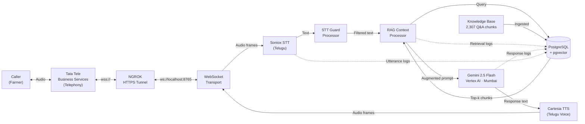

# Farm Vaidya — Telugu Voice Agent (POC)

Real-time Telugu voice agent for telephonic farmer support, powered by RAG over the Farm Vaidya knowledge base.

---

## Architecture



Full diagram with sequence and ER: [docs/architecture_diagram.md](docs/architecture_diagram.md)

---

## Quick Start (Fedora · Podman · NGROK)

### 1. Prerequisites

```bash
sudo dnf install podman podman-compose   # Fedora
pip install ngrok                        # or: snap install ngrok
```

### 2. Clone and configure

```bash
git clone <repo-url>
cd FarmV-POC
cp .env.example .env
# Edit .env — fill all API keys
```

### 3. Place credentials

```bash
mkdir -p credentials knowledge_base

# Vertex AI service account JSON
cp /path/to/sa.json credentials/vertex-ai-project-494805-0340a8a815b9.json

# Knowledge base (DOCX)
cp /path/to/rythunestam_kb_v1.4.docx knowledge_base/
```

### 4. Start containers

```bash
podman compose up -d
podman compose logs -f voice_agent      # watch startup — wait for "Server ready on port 8080"
```

### 5. Ingest knowledge base

```bash
podman exec farmvaidya_agent python scripts/ingest_kb.py
# Expected: "Ingested N chunks into pgvector"
```

### 6. Expose via NGROK

```bash
# Authenticate (once)
ngrok config add-authtoken YOUR_NGROK_AUTHTOKEN

# Start tunnel (keep this terminal open)
ngrok start --config ngrok.yml farmvaidya
```

Copy the HTTPS URL shown by NGROK (e.g. `https://abc123.ngrok.io`).

### 7. Configure Tata Tele SmartFlo

In the Tata Tele SmartFlo portal, set the **WebSocket Callback URL** for your DID number:

```
wss://abc123.ngrok.io/ws/smartflo
```

Headers sent by Tata Tele (read by the agent):
- `X-Caller-ID` — caller's phone number
- `X-Call-ID` — Tata Tele call reference ID

### 8. Verify

```bash
curl http://localhost:8765/health
# {"status":"ok","active_sessions":0}

curl http://localhost:8765/metrics
# {"active_calls":0,"completed_calls":N,...}
```

Place a test call to your DID number. Monitor:
```bash
podman compose logs -f voice_agent
```

---

## Environment Variables

| Variable | Description | Required |
|---|---|---|
| `POSTGRES_HOST` | `postgres` (inside container) / `localhost` (local) | Yes |
| `POSTGRES_PORT` | Default `5433` on host | Yes |
| `POSTGRES_DB` | Database name | Yes |
| `POSTGRES_USER` | DB user | Yes |
| `POSTGRES_PASSWORD` | DB password | Yes |
| `GOOGLE_CLOUD_PROJECT` | GCP project ID | Yes |
| `GOOGLE_CLOUD_REGION` | Vertex AI region — `asia-south1` | Yes |
| `GOOGLE_APPLICATION_CREDENTIALS` | Path to service account JSON | Yes |
| `LLM_MODEL` | `gemini-2.5-flash` | Yes |
| `SONIOX_API_KEY` | Soniox STT API key | Yes |
| `CARTESIA_API_KEY` | Cartesia TTS API key | Yes |
| `CARTESIA_TELUGU_VOICE_ID` | Cartesia Telugu voice ID | Yes |
| `TATA_TELE_API_KEY` | Tata Tele API key | Yes |
| `TATA_TELE_ENDPOINT` | Tata Tele WebSocket URL | Yes |
| `TATA_TELE_DID_NUMBER` | DID number for inbound calls | Yes |
| `RAG_TOP_K` | Chunks to retrieve per query (default `5`) | No |
| `RAG_SIMILARITY_THRESHOLD` | Minimum cosine score (default `0.65`) | No |
| `SERVER_PORT` | HTTP + WebSocket port (default `8080`) | No |
| `LOG_LEVEL` | `INFO` / `DEBUG` | No |

---

## Useful Commands

```bash
# Live logs
podman compose logs -f voice_agent

# Rebuild and restart agent (after code change)
podman compose build voice_agent && podman compose up -d voice_agent

# Connect to PostgreSQL
podman exec -it farmvaidya_postgres psql -U farmvaidya -d farmvaidya

# Query recent calls
podman exec -it farmvaidya_postgres psql -U farmvaidya -d farmvaidya \
  -c "SELECT session_id, phone_number, status, duration_s, turn_count FROM call_sessions ORDER BY started_at DESC LIMIT 10;"

# Stop (keep data)
podman compose down

# Stop and wipe DB
podman compose down -v
```

---

## Concurrent Calls

Each incoming WebSocket connection spawns an independent asyncio task with its own:
- Pipecat pipeline instance
- PostgreSQL session row
- LLM conversation history

Sessions are fully isolated — no shared state between calls. The asyncpg pool supports 20 concurrent DB connections, comfortably handling 5+ simultaneous calls.

---

## Database Tables

| Table | Purpose |
|---|---|
| `call_sessions` | One row per call — start/end, phone number, status, duration |
| `utterances` | Per-turn user speech with STT confidence and latency |
| `agent_responses` | Per-turn agent text with LLM latency |
| `retrieval_logs` | Retrieved chunks, scores, and retrieval latency per turn |
| `error_logs` | Typed errors (stt_failure, llm_timeout, etc.) |
| `performance_metrics` | Per-turn STT/retrieval/LLM/TTS/E2E latency breakdown |
| `knowledge_chunks` | 768-dim vectors for all KB chunks (pgvector IVFFlat) |

---

## Project Structure

```
FarmV-POC/
├── compose.yml               Podman Compose (postgres + voice_agent)
├── Dockerfile
├── ngrok.yml                 NGROK v3 tunnel config
├── schema.sql                PostgreSQL schema (auto-applied on first start)
├── .env.example
├── requirements.txt
├── scripts/
│   ├── ingest_kb.py          Ingest KB files → pgvector
│   └── init_db.py            Apply schema to existing DB
├── src/
│   ├── server.py             FastAPI: /health /metrics /ws/smartflo
│   ├── pipeline.py           Pipecat pipeline (per session)
│   ├── config.py             Typed settings from .env
│   ├── database.py           asyncpg pool
│   ├── error_handler.py      STTGuard + LLMRetry processors
│   ├── prompts.py            System prompt + Telugu canned responses
│   ├── rag/                  Chunker · embeddings · ingestion · retriever
│   ├── services/             LLM service (Vertex AI)
│   ├── telephony/            Tata Tele WebSocket transport
│   └── db_logger/            Async DB loggers
└── docs/
    ├── architecture_diagram.md
    ├── deployment_guide.md
    └── technical_notes.md
```

---

## Deliverables

| # | Item | Location |
|---|---|---|
| 1 | Source code | This repository |
| 2 | Architecture diagram | [docs/architecture_diagram.md](docs/architecture_diagram.md) |
| 3 | Deployment guide | [docs/deployment_guide.md](docs/deployment_guide.md) |
| 4 | Technical notes | [docs/technical_notes.md](docs/technical_notes.md) |
| 5 | Demonstration video | Pending |
