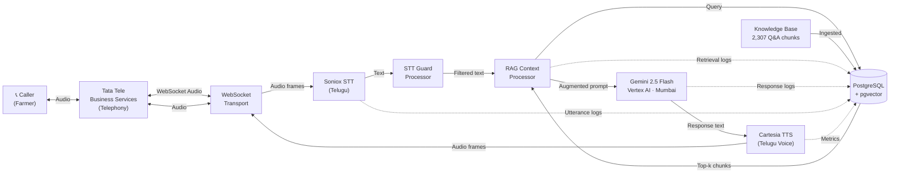

# Farm Vaidya — Telugu Voice Agent (POC)

Real-time Telugu voice agent for telephonic farmer support, powered by RAG over the Farm Vaidya knowledge base.

---

## Architecture



---

## Quick Start

### 1. Prerequisites
- Docker Desktop
- Python 3.11+
- Credentials: Soniox, Cartesia, Vertex AI, Tata Tele

### 2. Clone and configure
```bash
git clone <repo-url>
cd farmv-poc
cp .env.example .env
# Fill in all values in .env (see Environment Variables below)
```

### 3. Place credentials
```
credentials/
└── service_account.json    ← Vertex AI / Google Cloud service account JSON
```

### 4. Start the database
```bash
docker compose up postgres -d
```

### 5. Ingest the knowledge base
```bash
# Place KB files in knowledge_base/
cp "Rythunestam_Knowledge base_V 1.4 dt 19052026 (1).docx" knowledge_base/rythunestam_kb_v1.4.docx

python -m scripts.ingest_kb --source knowledge_base/
```

### 6. Start the voice agent
```bash
# Option A: Docker (recommended for production)
docker compose up --build

# Option B: Local dev
pip install -r requirements.txt
python -m src.server
```

The agent listens on:
- `http://localhost:8080/health` — health check
- `http://localhost:8080/metrics` — 24h call stats  
- `ws://localhost:8765/ws/call` — telephony WebSocket (Tata Tele connects here)

---

## Environment Variables

| Variable | Description | Example |
|---|---|---|
| `POSTGRES_HOST` | DB host | `localhost` |
| `POSTGRES_PORT` | DB port | `5433` |
| `POSTGRES_DB` | DB name | `farmvaidya` |
| `POSTGRES_USER` | DB user | `farmvaidya` |
| `POSTGRES_PASSWORD` | DB password | `changeme` |
| `GOOGLE_CLOUD_PROJECT` | GCP project ID | `my-project-123` |
| `GOOGLE_CLOUD_REGION` | Vertex AI region | `asia-south1` |
| `GOOGLE_APPLICATION_CREDENTIALS` | Path to service account JSON | `./credentials/sa.json` |
| `LLM_MODEL` | Gemini model name | `gemini-2.5-flash` |
| `SONIOX_API_KEY` | Soniox API key | `sk-...` |
| `CARTESIA_API_KEY` | Cartesia API key | `...` |
| `CARTESIA_TELUGU_VOICE_ID` | Cartesia Telugu voice ID | `...` |
| `TATA_TELE_API_KEY` | Tata Tele API key | `...` |
| `TATA_TELE_ENDPOINT` | Tata Tele WebSocket URL | `wss://...` |
| `TATA_TELE_DID_NUMBER` | Inbound DID number | `+9140...` |
| `RAG_TOP_K` | Chunks to retrieve per query | `5` |
| `RAG_SIMILARITY_THRESHOLD` | Minimum cosine score | `0.65` |
| `SERVER_PORT` | HTTP port | `8080` |
| `WEBSOCKET_PORT` | WebSocket port for telephony | `8765` |

---

## Tata Tele Configuration

1. Log in to the Tata Tele Business Services portal
2. Navigate to your DID number settings
3. Set the **Media Stream / Webhook URL** to: `ws://<your-server-ip>:8765/ws/call`
4. Set caller ID header to `X-Caller-ID` and call ID header to `X-Call-ID`
5. Confirm the audio format — our server expects **16-bit PCM at 16 kHz** (if Tata Tele uses µ-law 8kHz, update `src/telephony/tata_tele.py`)

---

## Concurrent Calls

Each incoming WebSocket connection spawns an independent asyncio task with its own:
- Pipecat pipeline instance
- PostgreSQL session row
- LLM message history

Sessions are completely isolated — no shared state between calls. The DB pool supports up to 20 concurrent connections, easily covering 5+ simultaneous calls.

---

## Database Schema

| Table | Purpose |
|---|---|
| `call_sessions` | One row per call — start/end time, phone number, status |
| `utterances` | Per-turn user speech with STT confidence and latency |
| `agent_responses` | Per-turn agent text with LLM and TTS latencies |
| `retrieval_logs` | Retrieved chunks, scores, and retrieval latency per turn |
| `error_logs` | Typed errors (stt_failure, llm_timeout, etc.) |
| `performance_metrics` | Per-turn STT/retrieval/LLM/TTS/E2E latency summary |
| `knowledge_chunks` | 768-dim embeddings for all KB chunks (pgvector) |

---

## Project Structure

```
src/
├── config.py           Settings from environment
├── database.py         asyncpg connection pool
├── pipeline.py         Pipecat pipeline (one instance per call)
├── prompts.py          Telugu system prompt + canned responses
├── server.py           FastAPI HTTP + /ws/call WebSocket entry
├── error_handler.py    STTGuard + LLMRetry frame processors
├── rag/
│   ├── chunker.py      Q&A pair extraction from .docx
│   ├── embeddings.py   Vertex AI text-multilingual-embedding-002
│   ├── ingestion.py    Bulk KB ingest → pgvector
│   └── retriever.py    Hybrid cosine + full-text search
├── services/
│   └── llm.py          Vertex AI LLM service factory
├── telephony/
│   └── tata_tele.py    WebSocket transport + Silero VAD
└── db_logger/
    └── loggers.py      Async DB logging for all pipeline events
scripts/
├── init_db.py          Apply schema.sql to existing DB
└── ingest_kb.py        Chunk, embed, and upsert KB files
```
