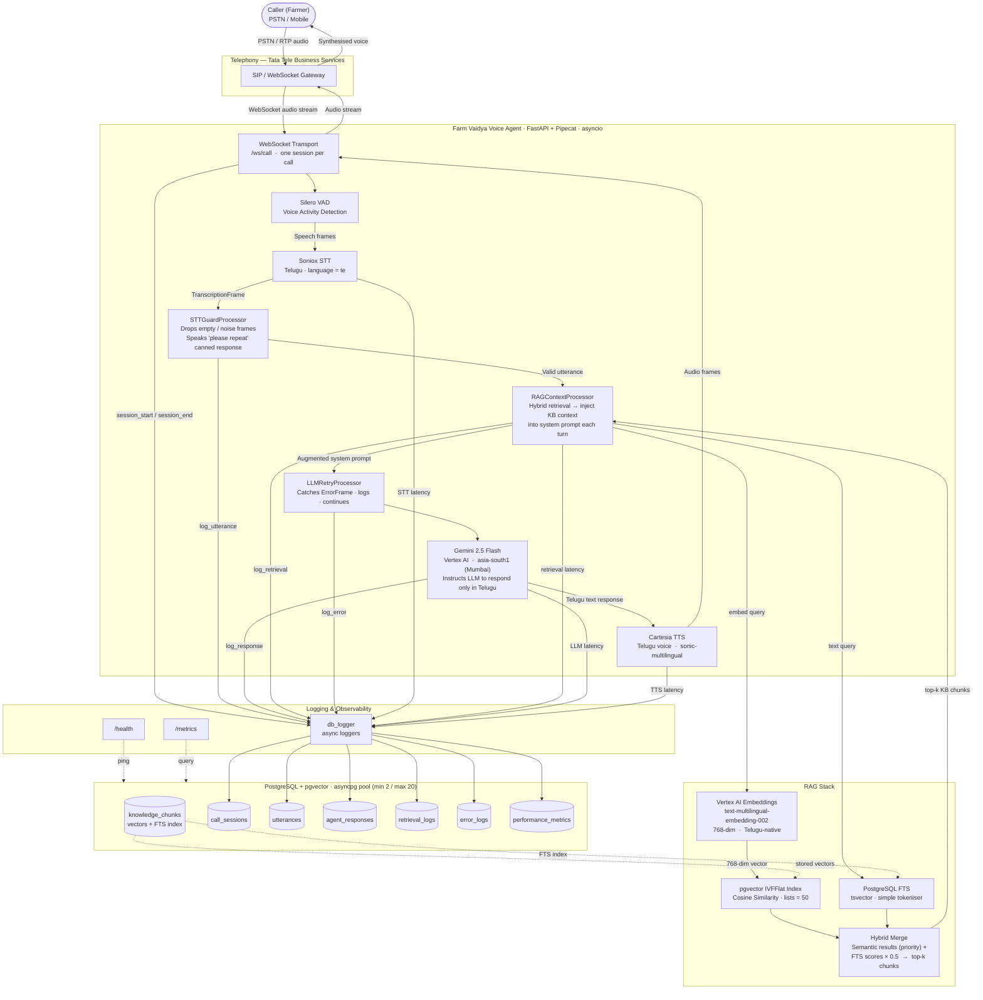
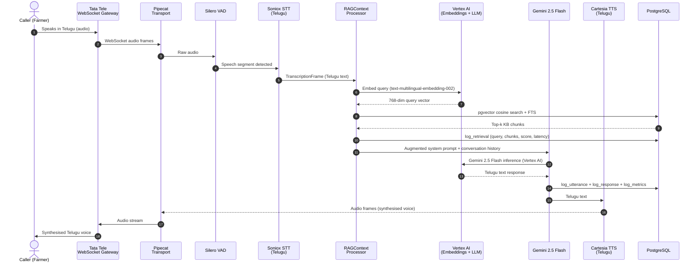
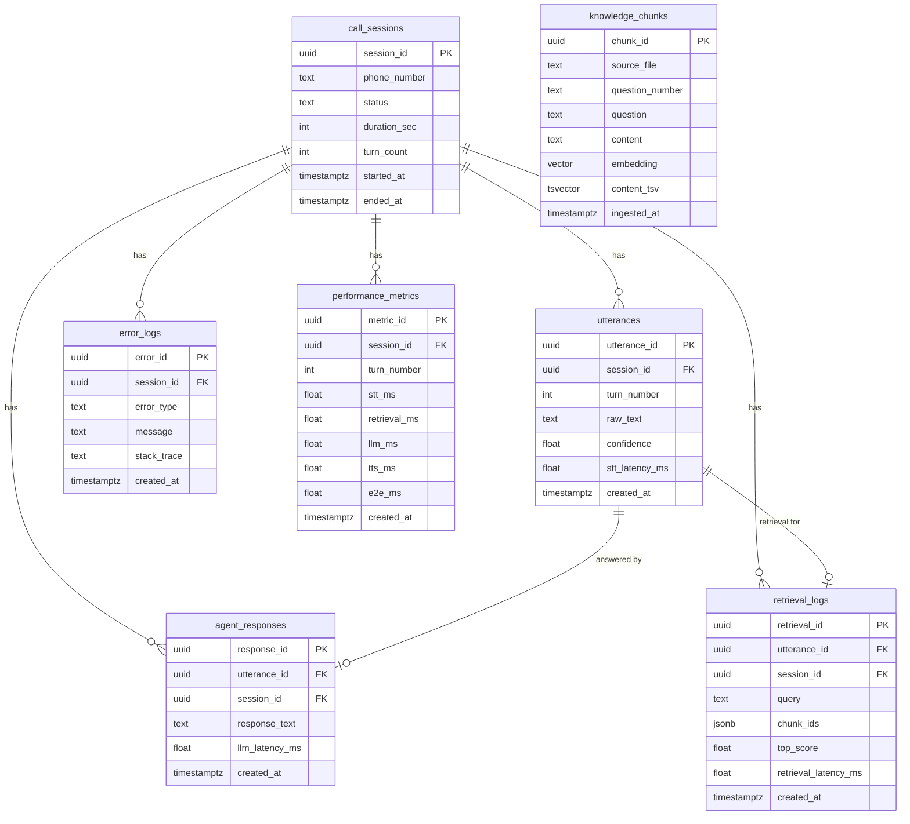

# Architecture Diagram — Farm Vaidya Telugu Voice Agent

## 1. System Overview



---

## 2. Call Sequence (Single Turn)



---

## 3. Component Summary

| Layer | Component | Technology |
|---|---|---|
| Telephony | Incoming / outgoing voice | Tata Tele Business Services (SIP → WebSocket) |
| Transport | WebSocket session management | Pipecat `WebsocketServerTransport` + FastAPI |
| VAD | End-of-speech detection | Silero VAD (built into Pipecat) |
| STT | Speech-to-text | Soniox — Telugu (`language=te`) |
| RAG | Knowledge retrieval | pgvector (cosine) + PostgreSQL FTS — hybrid merge |
| Embeddings | Query + chunk vectorisation | Vertex AI `text-multilingual-embedding-002` (768-dim) |
| LLM | Response generation | Gemini 2.5 Flash — Vertex AI, `asia-south1` (Mumbai) |
| TTS | Text-to-speech | Cartesia — `sonic-multilingual`, Telugu voice |
| Database | Persistence + vector store | PostgreSQL 15 + pgvector extension |
| Logging | Async event capture | `db_logger` → 6 PostgreSQL tables |
| Deployment | Containerisation | Docker Compose (app + postgres) |

---

## 4. Database Schema



---

## 5. Concurrency Model

```
                     ┌─────────────────────────────────────────────┐
                     │         FastAPI  (single process)           │
                     │                                             │
  Call 1 ─WebSocket─►│  asyncio Task 1  ──► Pipeline Instance 1  │
  Call 2 ─WebSocket─►│  asyncio Task 2  ──► Pipeline Instance 2  │
  Call 3 ─WebSocket─►│  asyncio Task 3  ──► Pipeline Instance 3  │
  Call 4 ─WebSocket─►│  asyncio Task 4  ──► Pipeline Instance 4  │
  Call 5 ─WebSocket─►│  asyncio Task 5  ──► Pipeline Instance 5  │
                     │                                             │
                     │  asyncpg pool  (min 2 / max 20 conns)      │
                     └────────────────────┬────────────────────────┘
                                          │
                                   ┌──────▼──────┐
                                   │  PostgreSQL  │
                                   │  + pgvector  │
                                   └─────────────┘

  Scaling beyond 5 calls:
  Multiple Docker containers ──► shared PostgreSQL (only shared resource)
```
