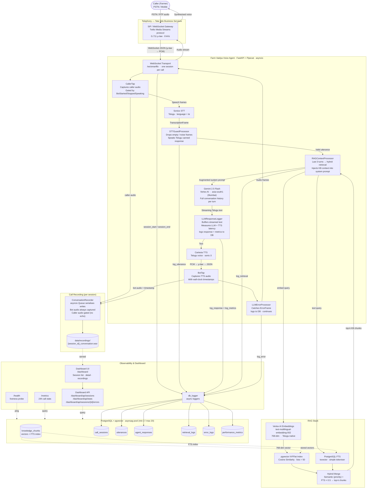
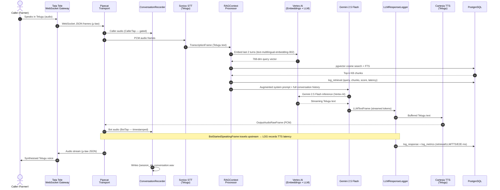
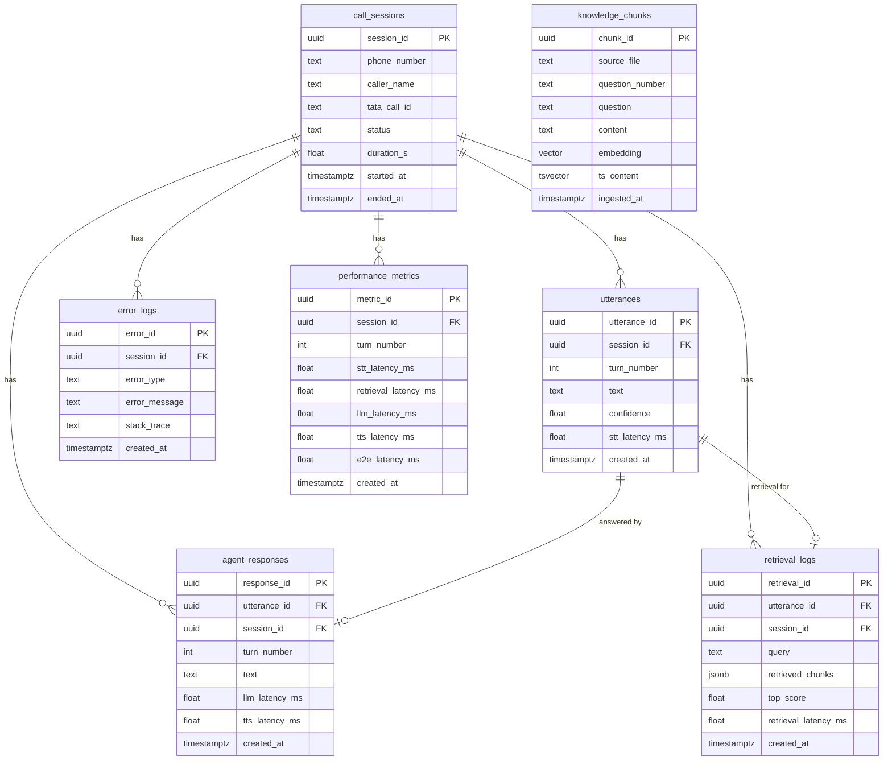

# Architecture Diagram — Farm Vaidya Telugu Voice Agent

## 1. System Overview



---

## 2. Pipeline Processor Order (per session)

```
transport.input()
  │
  ├─► CallerTap               ← captures caller audio; gates on BotStarted/StoppedSpeaking (upstream)
  │
  ├─► SonioxSTT               ← audio → Telugu text (TranscriptionFrame)
  │
  ├─► STTGuardProcessor       ← drops empty / noise frames; speaks canned Telugu response
  │
  ├─► LLMUserContextAggregator← accumulates conversation history
  │
  ├─► RAGContextProcessor     ← embeds last 3 turns; hybrid retrieval; injects KB context
  │
  ├─► Gemini 2.5 Flash        ← streams Telugu response text (LLMTextFrame)
  │
  ├─► LLMResponseLogger       ← buffers streamed text; measures LLM + TTS latency; logs to DB
  │
  ├─► CartesiaTTS              ← text → PCM audio (OutputAudioRawFrame)
  │
  ├─► BotTap                  ← captures TTS audio with wall-clock timestamps
  │
  ├─► LLMErrorProcessor       ← catches ErrorFrame; logs; continues pipeline
  │
  └─► LLMAssistantContextAggregator ← adds assistant turn to conversation history
  │
transport.output()
```

---

## 3. Call Sequence (Single Turn)



---

## 4. Component Summary

| Layer | Component | Technology |
|---|---|---|
| Telephony | Incoming / outgoing voice | Tata Tele Business Services — Twilio Media Streams over WebSocket |
| Transport | WebSocket session management | Pipecat `FastAPIWebsocketTransport` + `TataTeleSerializer` (µ-law ↔ PCM) |
| VAD | End-of-speech detection | Silero VAD + Smart Turn v3 (Pipecat built-in) |
| STT | Speech-to-text | Soniox — Telugu (`Language.TE`) |
| Recording | Per-call WAV capture | `ConversationRecorder` + `CallerTap` / `BotTap` → `data/recordings/` |
| RAG | Knowledge retrieval | pgvector IVFFlat (cosine) + PostgreSQL FTS — hybrid merge |
| Embeddings | Query + chunk vectorisation | Vertex AI `text-multilingual-embedding-002` (768-dim, Telugu-native) |
| LLM | Response generation | Gemini 2.5 Flash — Vertex AI `GoogleVertexLLMService`, `asia-south1` (Mumbai) |
| Latency logging | Response + metrics capture | `LLMResponseLogger` — measures LLM + TTS latency via `BotStartedSpeakingFrame` |
| TTS | Text-to-speech | Cartesia — `sonic-3`, Telugu voice ID from env |
| Database | Persistence + vector store | PostgreSQL 15 + pgvector extension |
| Logging | Async event capture | `db_logger` → 6 PostgreSQL tables |
| Dashboard | Observability web UI | FastAPI + Tailwind CSS — session list, detail view, audio playback, error log |
| Deployment | Containerisation | Podman Compose (app + postgres) + NGROK tunnel |

---

## 5. Database Schema



---

## 6. Concurrency Model

```
                     ┌──────────────────────────────────────────────────────────┐
                     │              FastAPI  (single process · asyncio)         │
                     │                                                          │
  Call 1 ─WebSocket─►│  asyncio Task 1  ──► Pipeline 1  ──► Recorder 1 → WAV │
  Call 2 ─WebSocket─►│  asyncio Task 2  ──► Pipeline 2  ──► Recorder 2 → WAV │
  Call 3 ─WebSocket─►│  asyncio Task 3  ──► Pipeline 3  ──► Recorder 3 → WAV │
  Call 4 ─WebSocket─►│  asyncio Task 4  ──► Pipeline 4  ──► Recorder 4 → WAV │
  Call 5 ─WebSocket─►│  asyncio Task 5  ──► Pipeline 5  ──► Recorder 5 → WAV │
                     │                                                          │
                     │  asyncpg pool  (min 2 / max 20 conns)                   │
                     └──────────────────────────┬───────────────────────────────┘
                                                │
                                  ┌─────────────▼──────────┐
                                  │      PostgreSQL         │
                                  │      + pgvector         │
                                  └─────────────────────────┘

  Session isolation:
    Each call has its own Pipeline instance, LLM context, RAGContextProcessor,
    ConversationRecorder, and asyncio Queue — zero shared mutable state.

  Scaling beyond 5 calls:
    Multiple Podman containers ──► shared PostgreSQL (only shared resource)
    Each container independently handles its own sessions and recordings.
```
